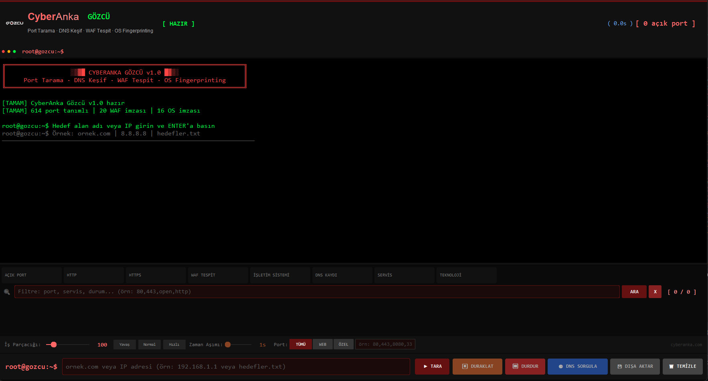

# Gözcü — Gelişmiş Port Tarama ve Ağ Keşif Aracı

CyberAnka - Gözcü

[](docs/arayuz.png)

Gözcü, Python ile geliştirilen modern masaüstü port tarama ve ağ analiz aracıdır. TCP port tarama, servis tespiti, HTTP analizleri, DNS keşfi, WAF tespiti, teknoloji algılama ve işletim sistemi fingerprinting işlemlerini tek arayüz üzerinden gerçekleştirir.

> **Uyarı**
>
> Bu araç yalnızca sahibi olduğunuz veya test yetkinizin bulunduğu sistemlerde kullanılmalıdır. İzinsiz gerçekleştirilen taramalardan kullanıcı sorumludur.

---

# Özellikler

- Yüksek hızlı çok iş parçacıklı TCP port tarama
- 500+ servis tanımlı port veritabanı
- HTTP / HTTPS servis keşfi
- Web sunucu başlık analizi
- Sayfa başlığı (Title) tespiti
- Response Time ölçümü
- WAF tespiti
- Web teknolojisi algılama
- İşletim sistemi fingerprinting
- Banner grabbing
- DNS kayıt analizi

Desteklenen DNS kayıtları:

- A
- AAAA
- MX
- NS
- TXT
- SOA
- CNAME

Ayrıca;

- Servis kategorilendirme
- HTTP teknoloji analizi
- SSL destekli servis kontrolü
- Çoklu hedef desteği
- Canlı istatistik ekranı
- Terminal görünümünde çıktı sistemi
- Duraklat / Devam Et
- Taramayı durdurma
- Filtreleme sistemi

---

# Desteklenen Teknoloji Tespitleri

Gözcü aşağıdaki teknolojileri otomatik olarak algılayabilir.

### CMS

- WordPress
- Joomla
- Drupal
- Magento
- PrestaShop
- Shopify
- Wix
- Squarespace

### Framework

- Laravel
- Django
- Flask
- Symfony
- Ruby on Rails
- ASP.NET

### Frontend

- React
- Next.js
- Vue.js
- Nuxt.js
- Angular

### Web Sunucuları

- Apache
- Nginx
- IIS
- LiteSpeed
- Caddy
- OpenResty

---

# Desteklenen WAF Tespitleri

- Cloudflare
- AWS WAF
- Akamai
- Fastly
- Imperva
- F5 BIG-IP
- Barracuda
- Fortinet
- StackPath
- ModSecurity
- Wordfence
- Sucuri
- Citrix NetScaler
- Varnish
- Naxsi
- Radware
- Comodo
- Airlock

---

# Servis Tanıma

Gözcü;

- FTP
- SSH
- SMTP
- POP3
- IMAP
- DNS
- HTTP
- HTTPS
- MySQL
- PostgreSQL
- MongoDB
- Redis
- MSSQL
- Oracle
- SMB
- LDAP
- SNMP
- Docker
- Kubernetes
- RabbitMQ
- Kafka
- Elasticsearch
- Cassandra
- Grafana
- Jenkins
- Kibana
- Synology
- VMware
- OpenVPN
- RDP
- VNC

ve yüzlerce farklı servis için otomatik tanımlama yapmaktadır.

---

# İşletim Sistemi Fingerprinting

TTL, Window Size ve DF analizleri kullanılarak yaklaşık işletim sistemi tahmini yapılabilir.

Desteklenen sistemler;

- Linux
- Windows
- macOS
- FreeBSD
- OpenBSD
- Solaris
- Cisco IOS
- Android
- HP-UX
- AIX

---

# Gereksinimler

- Python 3.9+
- İnternet bağlantısı (servis veritabanı güncellemesi için)

İlk çalıştırmada gerekli paketler otomatik kurulur.

Kurulan paketler:

- customtkinter
- Pillow
- requests
- urllib3
- xlsxwriter
- dnspython
- idna

---

# Kurulum

```bash
git clone https://github.com/CyberAnka-Projects/gozcu.git

cd gozcu

python gozcu.py
```

---

# Kullanım

1. Domain veya IP adresi girin.
2. Port taramasını başlatın.
3. Açık portlar otomatik analiz edilir.
4. HTTP servisleri detaylı incelenir.
5. DNS kayıtları çıkarılır.
6. İşletim sistemi tahmini yapılır.
7. WAF ve kullanılan teknolojiler görüntülenir.

---

# Teknik Özellikler

- Python ThreadPoolExecutor tabanlı paralel tarama
- Socket seviyesinde TCP tarama
- HTTP Header analizi
- Banner Grabbing
- SSL Socket desteği
- DNS Resolver entegrasyonu
- Dynamic Service Mapping
- Gerçek zamanlı GUI güncellemesi
- CustomTkinter arayüzü

---

# Arayüz

- CyberAnka temalı modern GUI
- Hacker terminal görünümü
- Gerçek zamanlı istatistik paneli
- Port filtreleme sistemi
- Canlı tarama ilerleme çubuğu
- Splash Screen
- Karanlık tema

---

# Klasör Yapısı

```
.
├── gozcu.py
├── docs
│   ├── arayuz.png
├── LICENSE
└── README.md
```

---

# Lisans

Bu proje MIT Lisansı ile lisanslanmıştır.

Detaylar için **LICENSE** dosyasını inceleyebilirsiniz.
